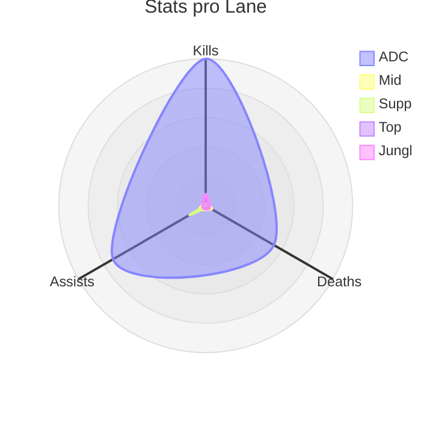
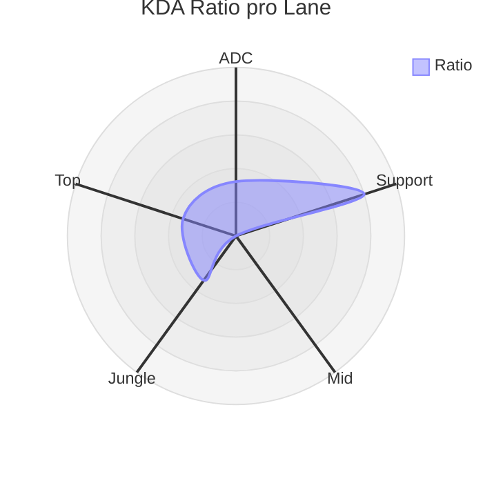
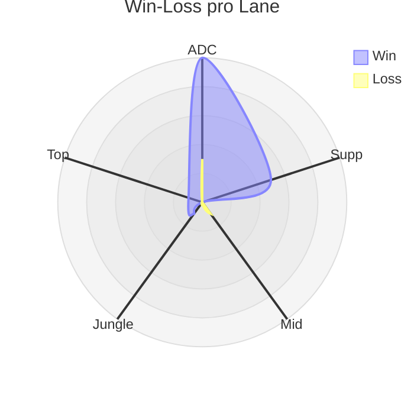
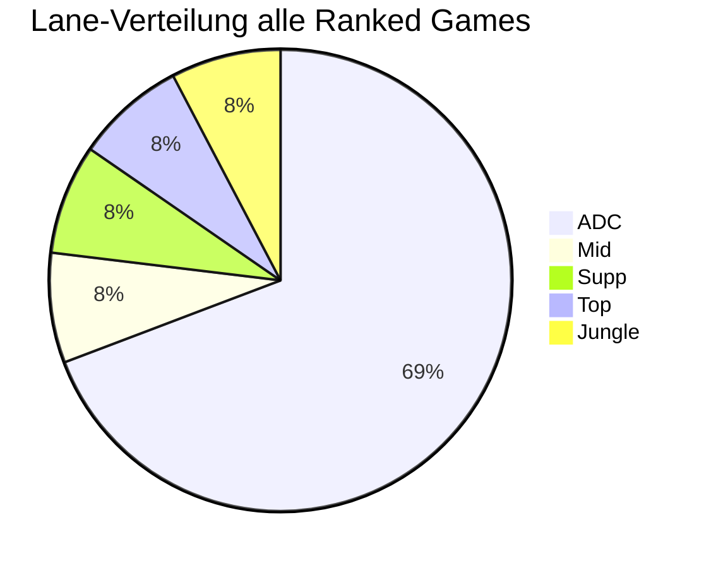
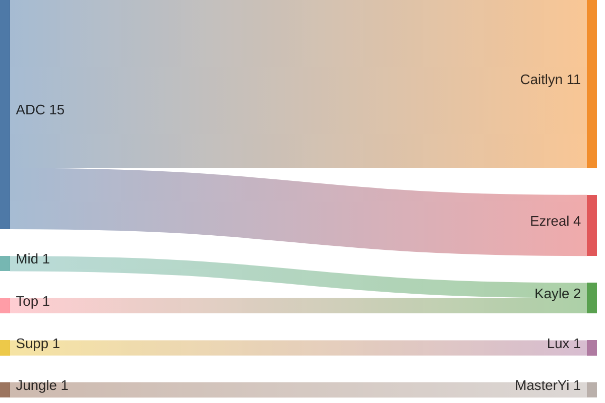

## Wild Rift Ranked Season 19

### Tabellarische Übersicht

|Lane  |Kill|Death|Assist|Ratio|Win|Loss|%   |
|:-----|:--:|:---:|:----:|----:|:-:|:--:|:--:|
|ADC   |125  |67   |91    |3.23 |10  |5   |66% |
|Supp  |0   |2    |16    |8.0  |1  |0   |100%|
|Mid   |2   |6    |6     |1.4  |0  |1   |0%  |
|Jungle|10   |4    |3     |3.25  |1  |0   |100%  |
|Top   |7   |3    |3     |3.3  |1  |0   |100%  |

### Stats pro Lane

### Champion-Verteilung pro Lane

