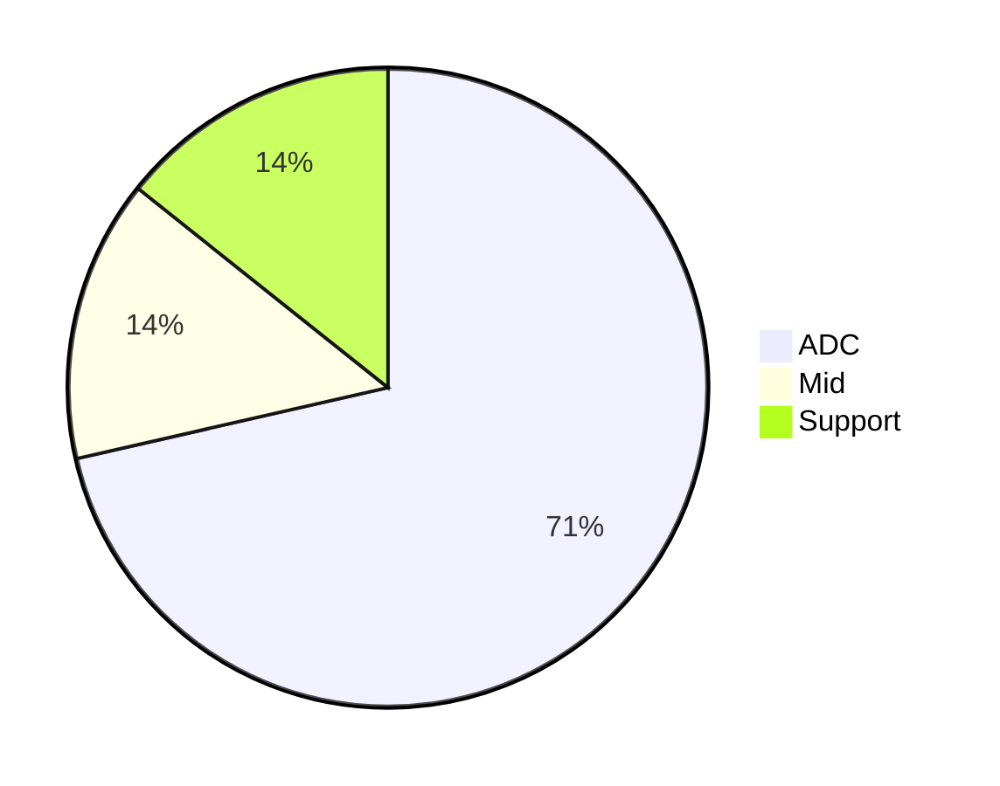
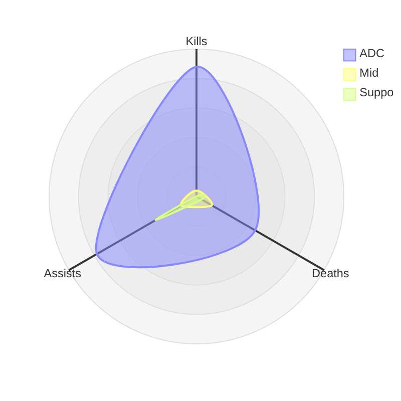
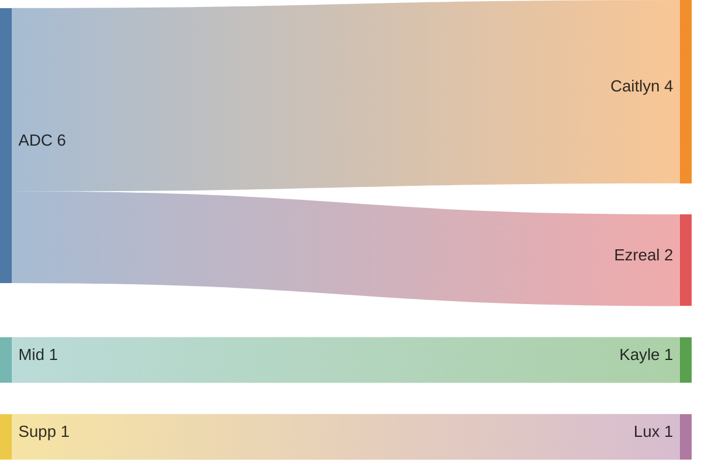

## Stats pro Lane

```mermaid
pie 
    "ADC" : 5
    "Mid" : 1
    "Support" : 1
```

```mermaid
---
config:
  radar:
    width: 300
    height: 300
---
radar-beta
  axis k["Kills"], d["Deaths"], a["Assists"]
  curve a["ADC"]{44, 23, 39}
  curve m["Mid"]{2, 6, 6}
  curve s["Support"]{0, 2, 16}

  max 50
  min 0
```

## Champion-Verteilung pro Lane

```mermaid
sankey-beta
  ADC, Caitlyn, 4
  ADC, Ezreal, 2
  Mid, Kayle, 1
  Supp, Lux, 1
``` 

