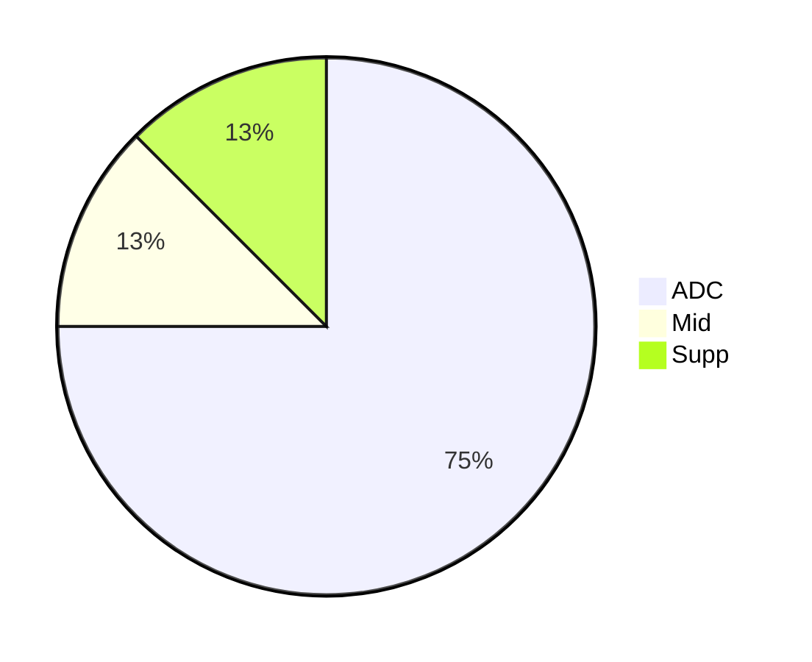
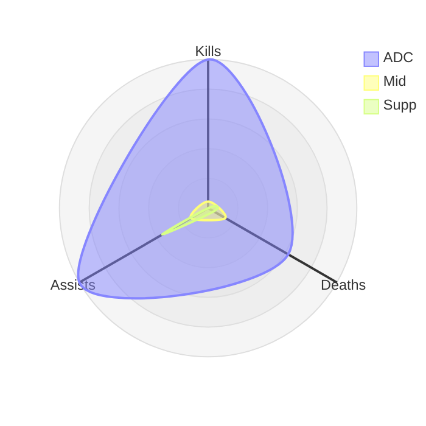
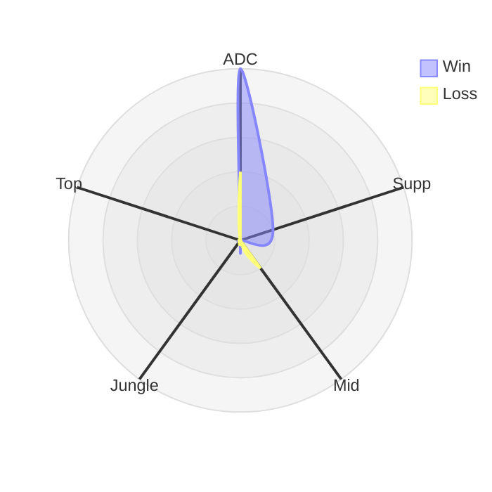
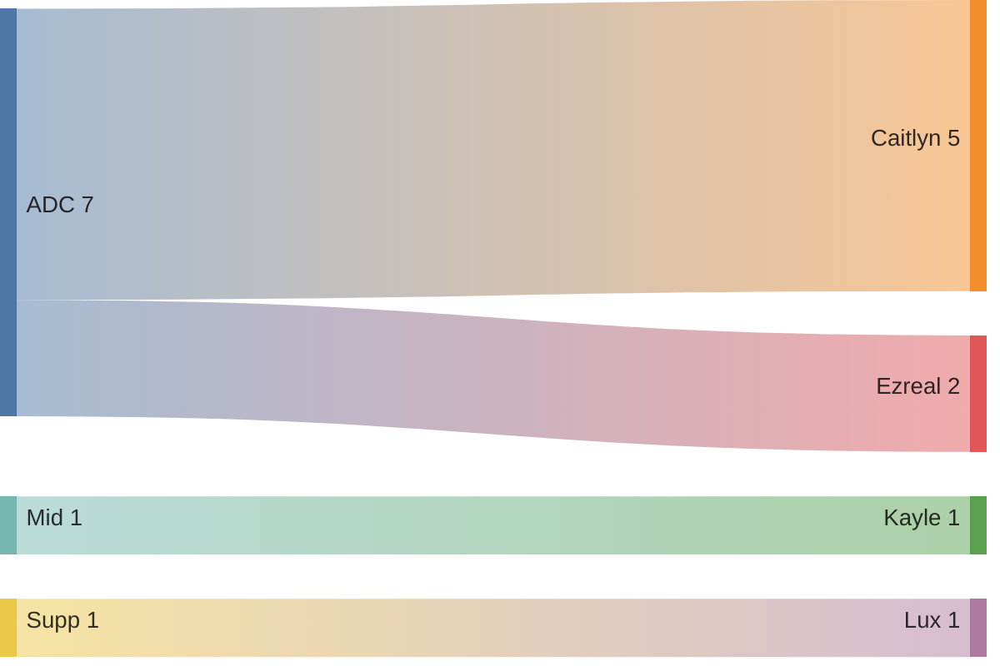

## Wild Rift Ranked Season 19

### Tabellarische Übersicht

|Lane  |Kill|Death|Assist|Ratio|
|:-----|:--:|:---:|:----:|----:|
|ADC   |48  |28   |54    |3.28 |
|Supp  |0   |2    |16    |8.0  |
|Mid   |2   |6    |6     |1.4  |
|Jungle|0   |0    |0     |0.0  |
|Top   |0   |0    |0     |0.0  |

Formel um die KDA Ratio zu berechnen:

$$
r=\frac{k+a}{d}
$$

### Stats pro Lane

### Win-Loss pro Lane

### Champion-Verteilung pro Lane

