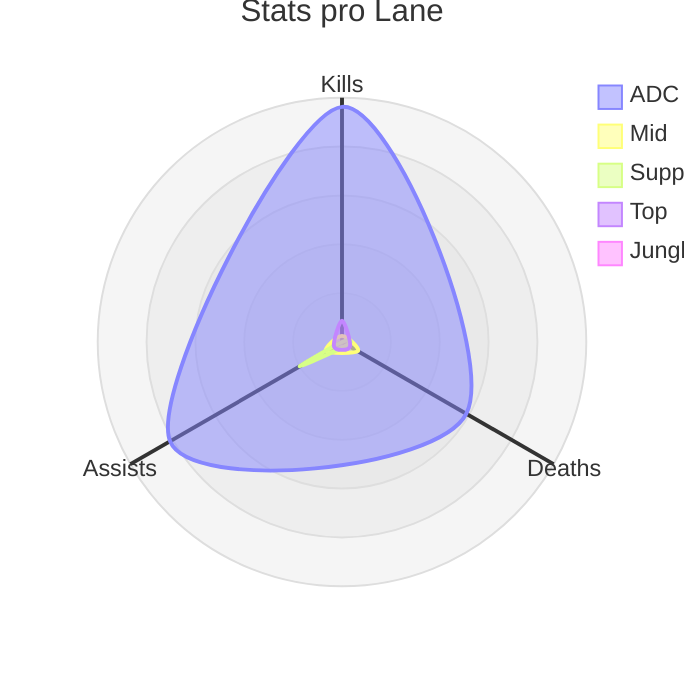
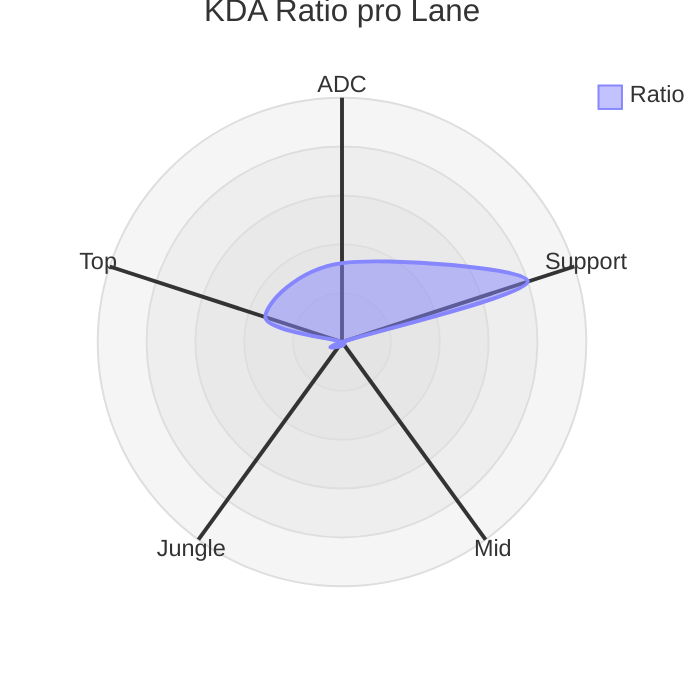
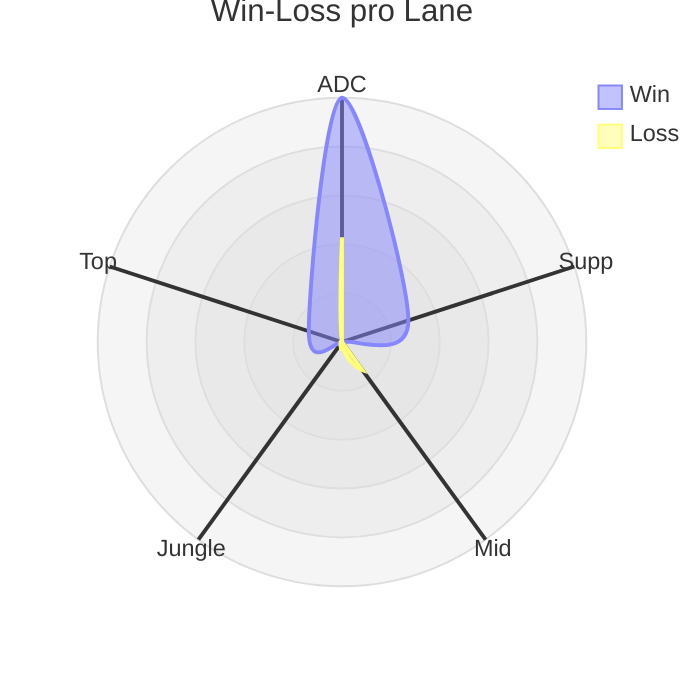
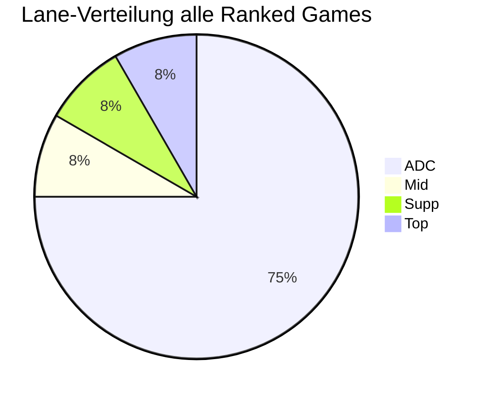
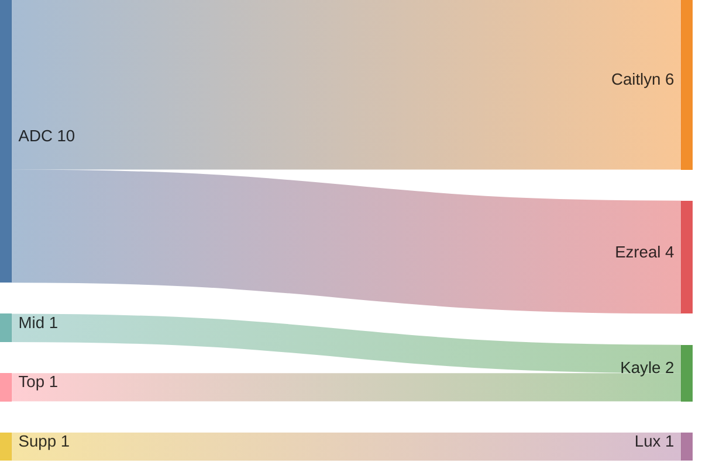

## Wild Rift Ranked Season 19

### Tabellarische Übersicht

|Lane  |Kill|Death|Assist|Ratio|Win|Loss|%   |
|:-----|:--:|:---:|:----:|----:|:-:|:--:|:--:|
|ADC   |77  |47   |75    |3.23 |7  |3   |70% |
|Supp  |0   |2    |16    |8.0  |1  |0   |100%|
|Mid   |2   |6    |6     |1.4  |0  |1   |0%  |
|Jungle|0   |0    |0     |0.0  |0  |0   |0%  |
|Top   |7   |3    |3     |3.3  |1  |0   |100%  |

### Stats pro Lane

### Champion-Verteilung pro Lane

