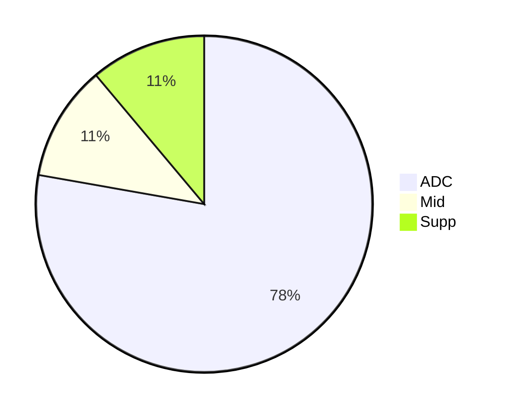
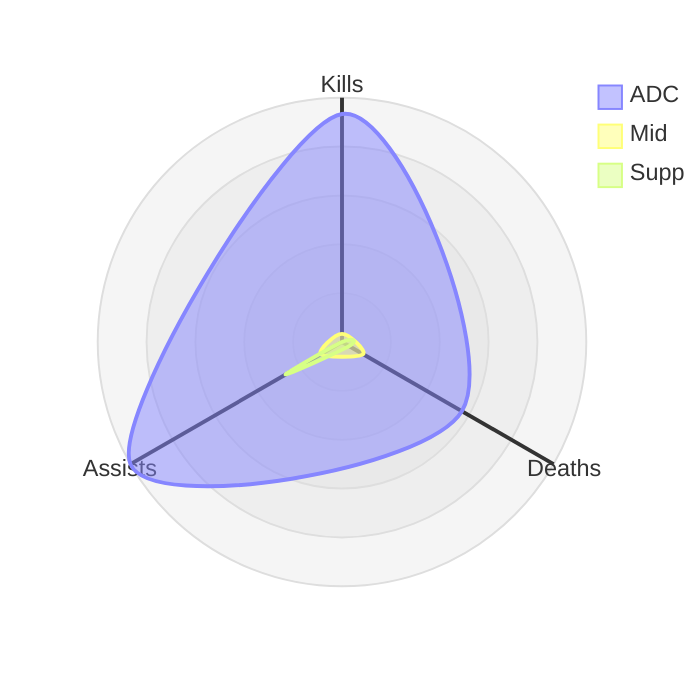
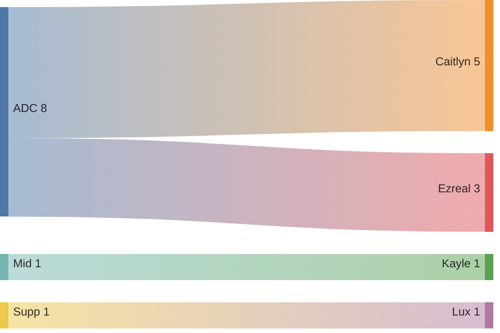

## Allgemein

### Die KDA Ratio berechnen

Formel um die KDA Ratio zu berechnen:

$$
r=\frac{k+a}{d}
$$

#### Beispielrechnungen

Ein ADC performed mit 14 Kills, 3 Deaths und 10 Assists, seine KDA liegt bei 8.0:

$$
\frac{14+10}{3}=8.0
$$

Ein Supp performed mit 1 Kill, 4 Deaths und 17 Assists, seine KDA liegt bei 4.5:

$$
\frac{1+17}{4}=4.5
$$

Bei einem Jungler läuft es sehr schlecht, er beendet das Game mit 2 Kills, 7 Deaths, und 4 Assists:

$$
\frac{2+6}{7}=0.85
$$

## Wild Rift Ranked Season 19

### Tabellarische Übersicht

|Lane  |Kill|Death|Assist|Ratio|Win|Loss|%   |
|:-----|:--:|:---:|:----:|----:|:-:|:--:|:--:|
|ADC   |56  |34   |60    |3.26 |6  |2   |75% |
|Supp  |0   |2    |16    |8.0  |1  |0   |100%|
|Mid   |2   |6    |6     |1.4  |0  |1   |0%  |
|Jungle|0   |0    |0     |0.0  |0  |0   |0%  |
|Top   |0   |0    |0     |0.0  |0  |0   |0%  |

### Stats pro Lane

 

### Win-Loss pro Lane

### Champion-Verteilung pro Lane

